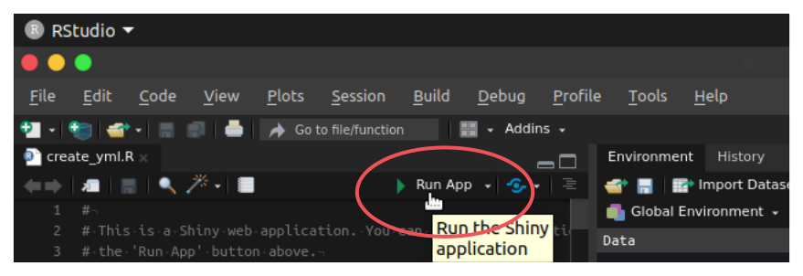
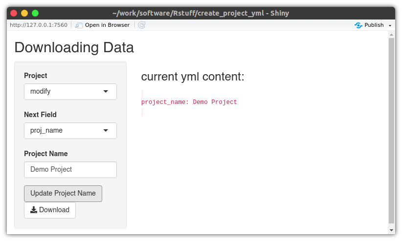
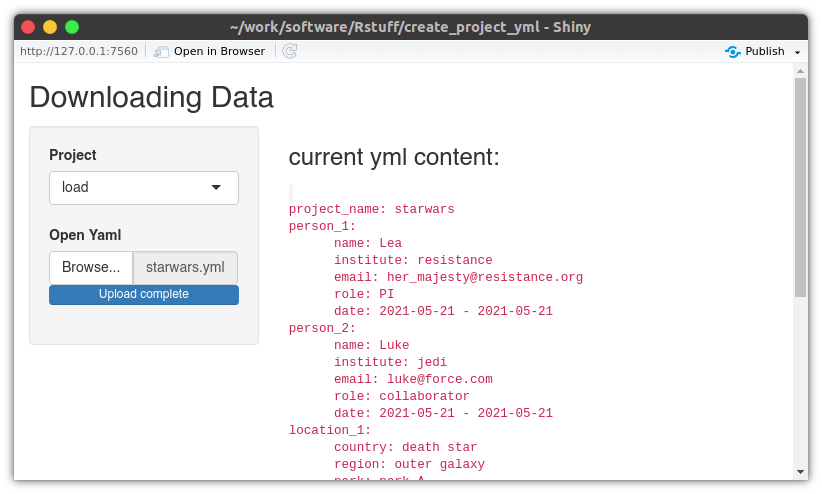

# Create a Project Metadata yml file

This repo contains a shiny app to create a pre-formatted `yml` file containing Project Metadata for a MPI AB project.

To run this you will need to open the file `create_yml.R` with [RStudio](https://www.rstudio.com/) and search for the *Run App* button:

After this, a window should pop up that allows you to load an existing `yml` file or to create a new one from scratch.

Creating a new File from scratch

Loading an existing file (eg. the provided demo `starwars.yml`)

The created/modified `yml` file can be save using the *Download* button within the *modify* tab.

This repo uses the {[renv](https://rstudio.github.io/renv/articles/renv.html)} package.
 So If you want to make sure to use the same setup that was used for the creation of the app, please start RStudio with `create_project_yml.Rproj` and call `renv::restore()` from that R session.
 (You might need to install {renv} first with `install.packages("renv")`)

---